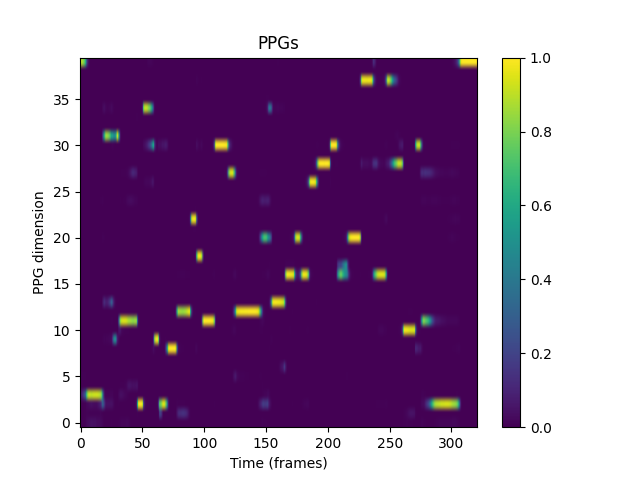

# Phoneme prediction

**Current version** : Using [Max Morrison's](https://www.maxrmorrison.com/pdfs/churchwell2024high.pdf) python package, this pipeline computes PPGs of audio files and offers visualization and saving tools.



*Figure: Example of PPGs visualization generated by the pipeline.*

## Description of the repository

The `data/` folder is organized as follows:
- `data/ppg/`: contains the PPG files generated by the pipeline (npy files)
- `data/images/`: contains the PPG files generated by the pipeline (png files)
/!\ Make sure to know the path to your audio files folder before running the pipeline

The `see_later/` folder contains a few python files related to another idea for the pipeline, for the moment it does not work. 

The `ppg_pipeline.py` file contains the main pipeline to compute PPGs from audio files. It computes the PPGs and save them in the `data/ppg/` folder. It also generates images of the PPGs and saves them in the `data/images/` folder.

The `run.py` file is a ready-to-use script that runs the pipeline. The explanation of the parameters is given below.

## How to install 

1. Clone the repository
```bash
git clone https://github.com/LouisLeDain/ppg_prediction.git
cd ppg_prediction
```
2. Create a virtual environment
```bash
python -m venv .venv
```
3. Activate the virtual environment
```bash
# On Windows
.venv\Scripts\activate
# On Linux
source .venv/bin/activate
```
4. Install the required packages
```bash
pip install -r requirements.txt
```

## Getting started

1. Make sure you have your audio files in a folder. The audio files should be in wav format.

2. Run the pipeline
```bash
python run.py --audio_file 'path/to/your/file(s)'
```

3. More tools can be used by customizing the non-required parameters of the pipeline. The parameters are explained below.
```
--sample_rate : sampling rate, initially set to 16000,
--gpu : (int) index of the GPU to use, initially set to None (cpu),
--should_print : (bool) whether to print information on the computation progress, initially set to False, 
--save_folder : (str) 'path/to/your/folder' where the PPGs (npy) will be saved, 
--visualization_save_folder : (str) 'path/to/your/folder' where the PPGs (png) will be saved,
--save : (bool) whether to save the PPGs (npy), initially set to False,
--visualize : (bool) whether to visualize the PPGs (png), initially set to False
````
